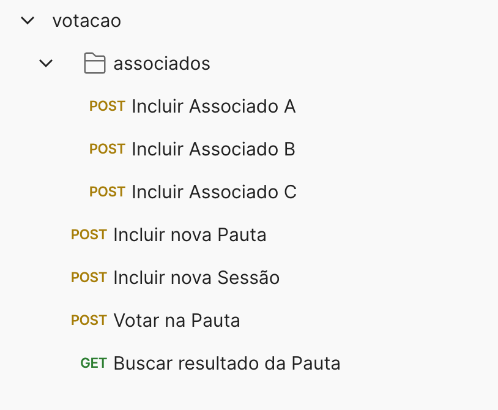
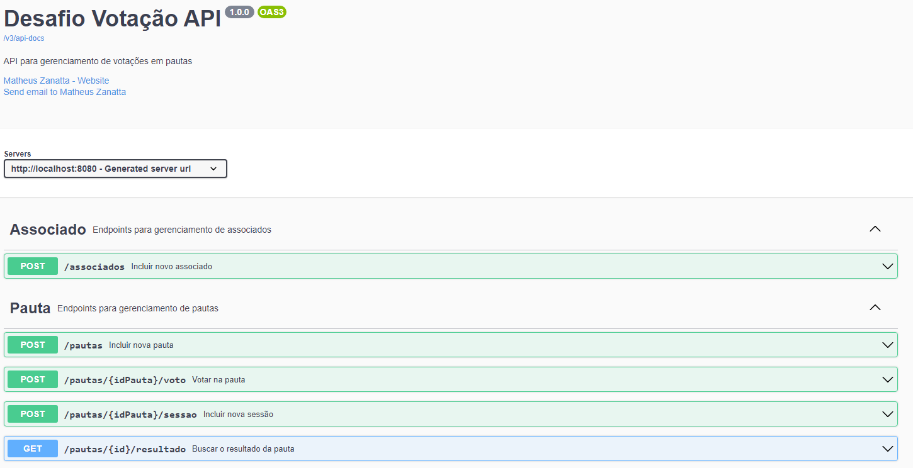
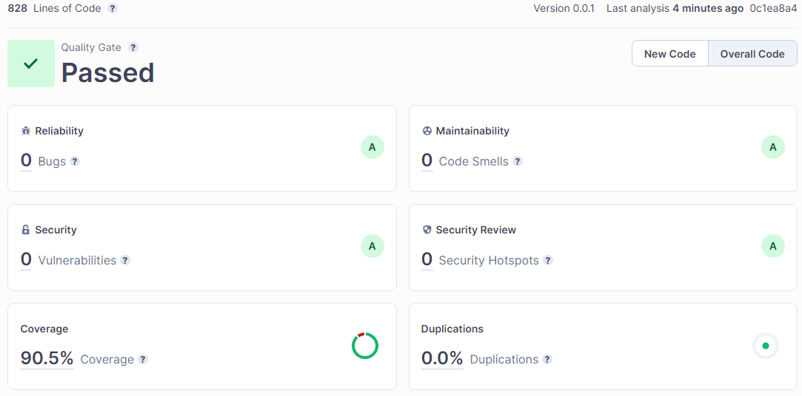
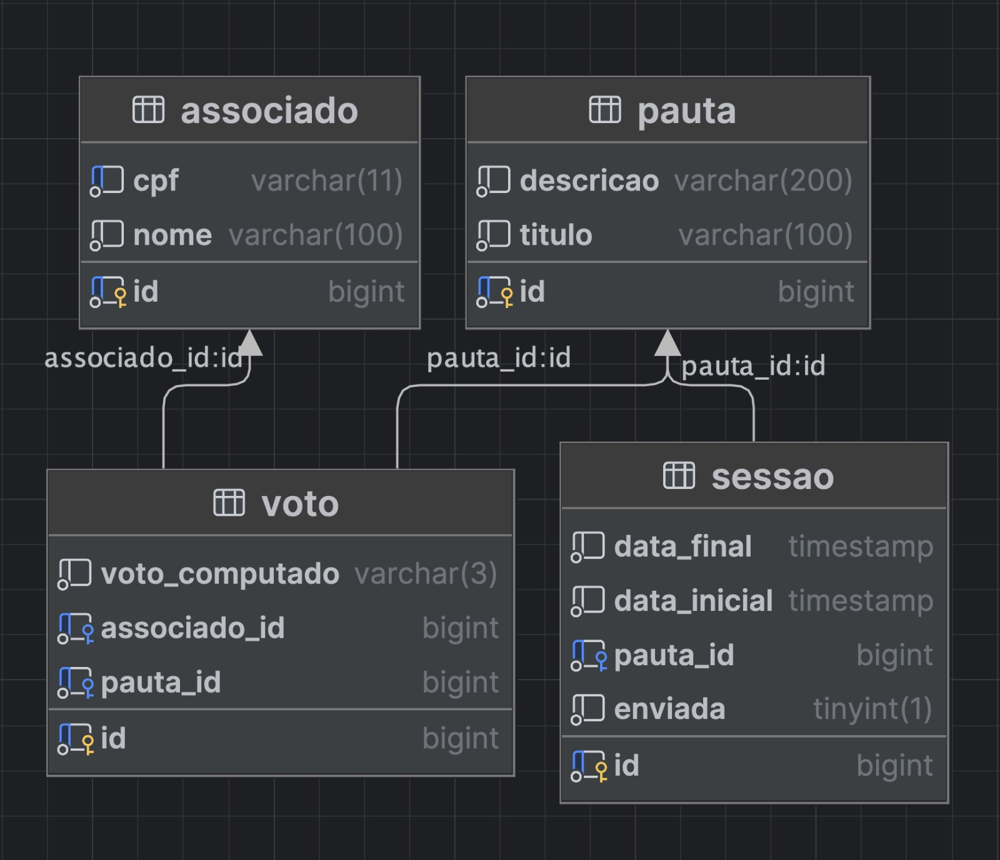
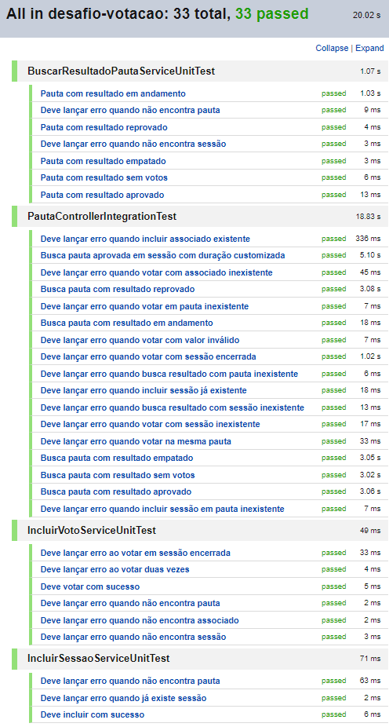
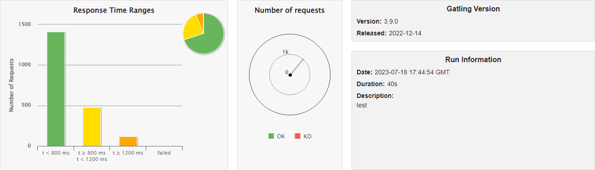
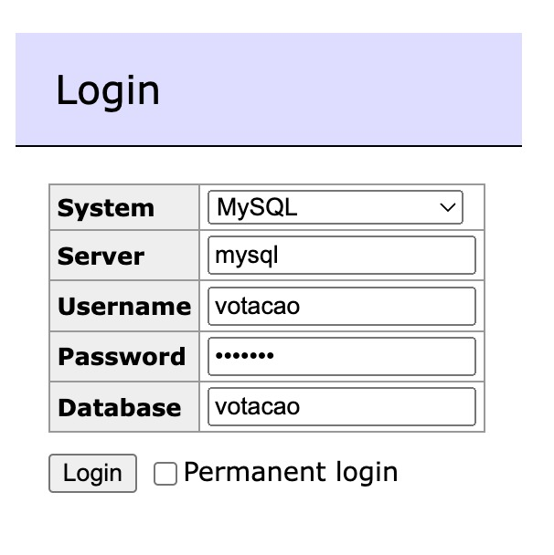

# Desafio Votação

## Sumário

- [Descrição](#descrição)
- [Funcionalidades](#funcionalidades)
- [Pré-requisitos](#pré-requisitos)
- [Execução do Projeto](#execução-do-projeto)
- [Acesso as funcionalidades](#acesso-as-funcionalidades)
- [Documentação da API](#documentação-da-api)
- [Sonar Cloud](#sonar-cloud)
- [Diagrama ER](#diagrama-er)
- [Testes](#testes)
- [Teste de Carga](#teste-de-carga)
- [Setup Adminer](#setup-adminer)
- [Autores](#autores)
- [Contato](#contato)

## Descrição

No cooperativismo, cada associado possui um voto e as decisões são tomadas em pautas, por votação.
Com esse princípio, foi criada esta solução que gerencia as pautas.

Mais detalhes podem ser encontrados documento do desafio: [PDF](resources/desafio.pdf)

Obs: A Tarefa Bônus 1 não foi implementada, as instruções para realizar a tarefa estão com problemas.

## Funcionalidades

- Criação de pautas para votação.
- Criação de sessões em pautas.
- Criação de associados.
- Registro de voto do associado em pauta.
- Verificação do resultado da votação em uma pauta.
- Notificação de sessão encerrada via mensageria.

## Pré-requisitos

- `Docker` e `Docker Compose` instalados para subir os containers de banco de dados e mensageria.
- JDK mínima na versão 17 para execução do projeto.
- [Recomendado] Postman para acessar as funcionalidades.

## Execução do Projeto

- Clone o repositório do projeto em sua máquina local.
- Navegue até o diretório raiz do projeto.
- Execute o comando `docker-compose up -d` para subir os containers necessários.
- Execute o projeto.

Abaixo o exemplo dos comandos citados, que devem ser executes no terminal:

```ssh
git clone git@github.com:matheuszanatta/desafio-votacao.git
cd teste
docker-compose up -d
./mvnw spring-boot:run
```

## Acesso as funcionalidades

O projeto expõe as funcionalidades através de endpoints rest na url `http://localhost:8080` que podem ser facilmente
acessados utilizando ferramentas como o Postman.

Você pode acessar o diretório `resources/postman`, onde encontrará uma **collection** e um **environment** que podem ser
importados no Postman. Eles contêm exemplos de requisições para facilitar o uso da API.



## Documentação da API

Para visualizar e interagir a documentação da API, você pode acessar o Swagger UI através do navegador na
url `http://localhost:8080/swagger-ui.html`.



## Sonar Cloud

- Para executar o Sonar, basta acessar o diretório raiz do projeto e executar o comando `./mvnw sonar:sonar`. Os
  resultados serão exibidos no console. Para visualizar o resultado no SonarCloud, acesse
  o [LINK](https://sonarcloud.io/summary/overall?id=matheuszanatta_matheus-zanatta).



## Diagrama ER



## Testes

- Para executar os testes basta acessar o diretório raiz do projeto e executar o comando `./mvnw test`. Os resultados
  serão exibidos no console.

#### Resultado dos testes (unitários e integração)



## Teste de Carga

- Para executar os testes de carga é necessário, através de uma ide, executar a classe Engine.java que está no diretório
  `src/test/java/gatling/` e digitar no console `test` para executar todos os testes de carga. Os resultados serão
  exibidos no console.

#### Resultado do teste de carga (Gatling)



## Setup Adminer

- Para acessar o banco de dados, você pode utilizar o Adminer, que é um client de banco de dados web. Para acessá-lo,
  basta acessar a url `http://localhost:8181` e informar os dados de acesso conforme a imagem abaixo.



## Autores

- [Matheus Zanatta](https://github.com/matheuszanatta)

## Contato

Para entrar em contato com a equipe do projeto, envie um e-mail
para `matheus.zanatta.nh@gmail.com` ou abra uma issue no
repositório do GitHub.
